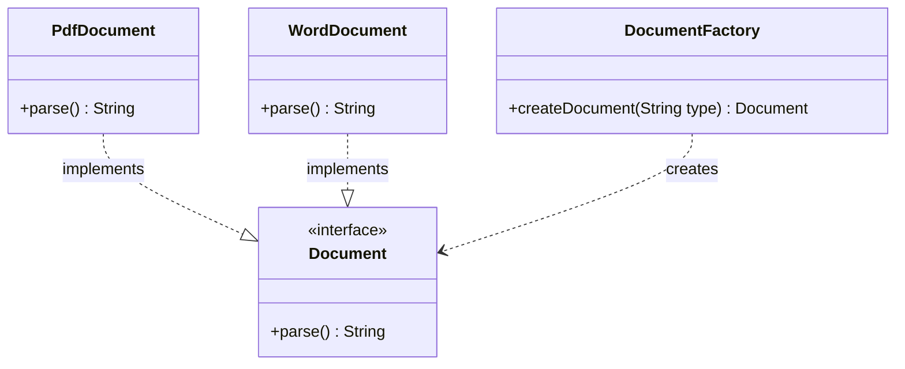

# Factory Design Pattern

## Intent
**Factory Method** is a creational design pattern that provides an interface for creating objects in a superclass, but allows subclasses to alter the type of objects that will be created.

## Class Diagram



## Problem Statement
We need to design a Document Reader/Parser system. The system can read documents of different formats (e.g., PDF or Word). Instead of having clients instantiate `PdfDocument` or `WordDocument` directly, we use a `DocumentFactory` to create the appropriate document type based on an input string. This decouples the client from concrete document classes.

## How to Test
Run the tests in the root folder to verify the implementation:
```bash
./gradlew :design-patterns:factory:test
```
