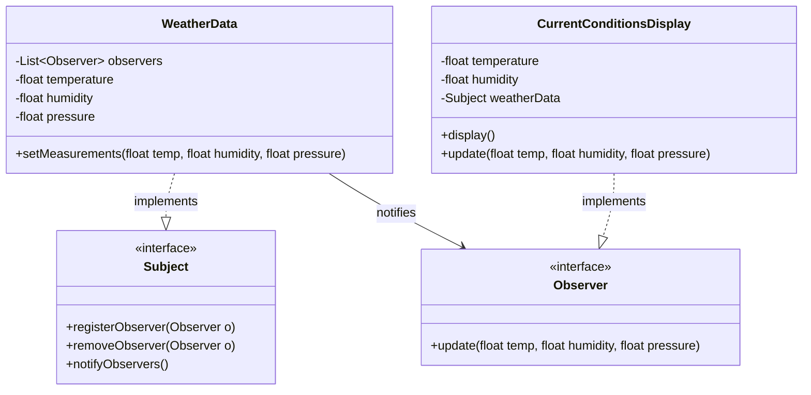

# Observer Design Pattern

## Intent
**Observer** is a behavioral design pattern that lets you define a subscription mechanism to notify multiple objects about any events that happen to the object they're observing.

## Class Diagram



## Problem Statement
We need to design a Weather Monitoring Station. The `WeatherData` object tracks the current weather measurements (temperature, humidity, pressure). We have various display elements (like `CurrentConditionsDisplay`) that need to be updated in real-time as the weather data changes.

## How to Test
Run the tests in the root folder to verify the implementation:
```bash
./gradlew :design-patterns:observer:test
```
