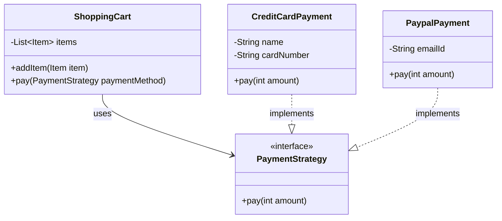

# Strategy Design Pattern

## Intent
**Strategy** is a behavioral design pattern that lets you define a family of algorithms, encapsulate each one, and make them interchangeable. Strategy lets the algorithm vary independently from clients that use it.

## Class Diagram



## Problem Statement
We need to design a Payment system for an E-commerce shopping cart. The user should be able to pay using different payment methods (e.g., Credit Card or PayPal). Rather than using conditional blocks (`if-else`) inside the shopping cart to handle different payment types, we encapsulate each payment algorithm in its own strategy class.

## How to Test
Run the tests in the root folder to verify the implementation:
```bash
./gradlew :design-patterns:strategy:test
```
