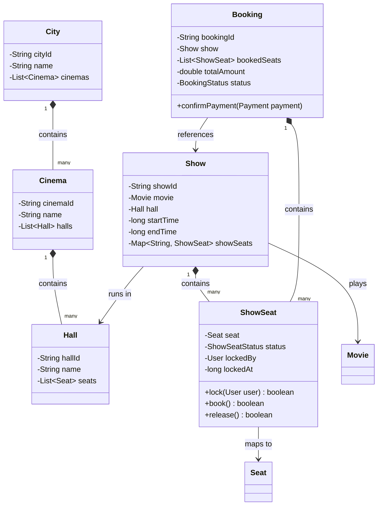

# Low-Level Design (LLD): BookMyShow (Movie Ticket Booking)

## Requirements

### Functional Requirements
1.  **Search Movies:** Users should be able to search movies by name, genre, city, or language.
2.  **Cinemas & Shows:** Each city has multiple cinemas (theaters). Each cinema has multiple screens (halls) running multiple shows.
3.  **Seat Layout & Selection:** Users can view the seat layout of a hall and select seats (e.g., Silver, Gold, Platinum).
4.  **Seat Locking:** When a user selects seats, they should be **temporarily locked** (e.g., for 5-10 minutes) so other users cannot book them while the payment is being processed.
5.  **Bookings & Payments:** Complete booking upon successful payment. Issue a ticket with a QR code.
6.  **Cancellations:** Allow booking cancellations and refunds if within the cancellation window.

---

## Class Diagram



---

## 🔒 Concurrency & Seat Locking (Critical Interview Topic)

The most critical discussion in a BookMyShow LLD interview is: **"How do you handle two users trying to book the same seat at the exact same time?"**

### 1. Temporary Seat Locking (The "Cart" Phase)
*   When a user clicks "Book", do not immediately create a permanent DB booking.
*   Acquire a temporary lock on the selected `ShowSeat` entities.
*   **Implementation Options:**
    *   **In-Memory Cache (Redis):** Set a key in Redis: `show_seat:lock:{show_id}:{seat_id}` with a value of the `user_id` and an expiration time (TTL) of 10 minutes.
        *   *Pros:* Extremely fast, automatic expiration.
    *   **Database Lock with Expiry Timestamp:** Add columns `locked_by_user_id` and `lock_expiry_time` to the `show_seats` table.
        *   A seat is available if `status == AVAILABLE` OR `(status == LOCKED && current_time > lock_expiry_time)`.

### 2. Handling Concurrency at the Database Level
When confirming the booking, you must prevent race conditions.

*   **Approach A: Optimistic Locking (Recommended for High Read/Low Write Conflict)**
    *   Add a `version` column to the `show_seats` table.
    *   When updating a seat status to `BOOKED` or `LOCKED`:
        ```sql
        UPDATE show_seats 
        SET status = 'LOCKED', locked_by = 'user_123', version = version + 1
        WHERE id = :seat_id AND version = :old_version AND status = 'AVAILABLE';
        ```
    *   If the update returns 0 affected rows, it means another thread updated the seat in the meantime. The system should reject the transaction and show "Seat already taken".

*   **Approach B: Pessimistic Locking (Strict Reservation)**
    *   Acquire a row-level write lock when selecting the seat:
        ```sql
        SELECT * FROM show_seats 
        WHERE id = :seat_id AND status = 'AVAILABLE' 
        FOR UPDATE;
        ```
    *   This blocks any other transaction trying to select or modify the row until the current transaction commits or rolls back.
