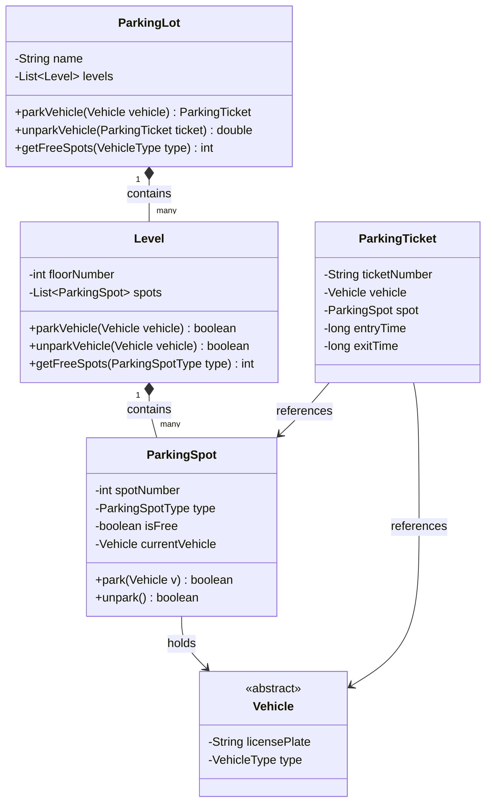

# Low-Level Design (LLD): Parking Lot

## Requirements

### Functional Requirements
1.  **Multiple Floors:** The parking lot should have multiple levels or floors.
2.  **Multiple Vehicle Types:** It should support motorcycles, cars, and large vehicles (trucks/buses).
3.  **Specific Spot Types:**
    *   Motorcycles can park in Motorcycle spots.
    *   Cars can park in Compact or Large spots.
    *   Large vehicles can only park in Large spots.
4.  **Ticket Generation:** The system should issue a parking ticket upon entry.
5.  **Fee Calculation:** Calculate fees based on the duration of parking (e.g., $10/hour for motorcycles, $20/hour for cars, $30/hour for large vehicles).
6.  **Real-Time Capacity Check:** Check spot availability on each floor and show a status message if the lot is full.

---

## Class Diagram



---

## How to Test
Run the tests in the root folder to verify the implementation:
```bash
./gradlew :lld:parking-lot:test
```
