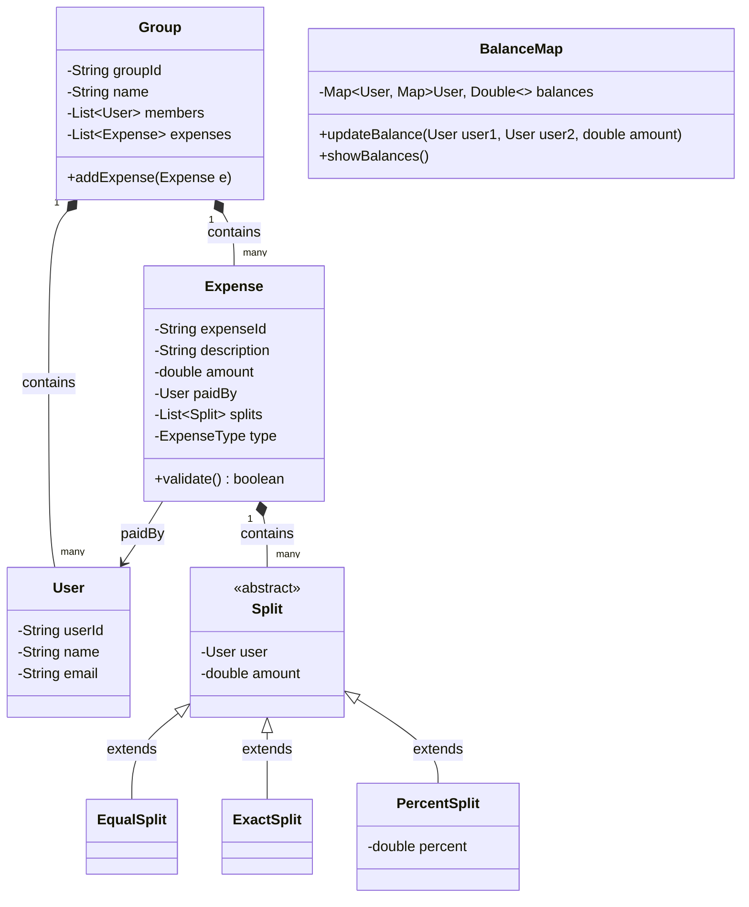

# Low-Level Design (LLD): Splitwise

## Requirements

### Functional Requirements
1.  **Users & Groups:** Users can register, create groups, and add other users to groups.
2.  **Add Expenses:** Users can add an expense inside a group or individually.
3.  **Split Strategies:** Support splitting expenses:
    *   **Equal Split:** Split the bill equally among participants.
    *   **Exact Amount Split:** Define exact amounts for each participant (must sum to the total).
    *   **Percentage Split:** Define split percentages for each participant (must sum to 100%).
4.  **Balance Queries:** Users can check how much they owe or are owed by others (individual balances or group balances).
5.  **Simplify Debts:** Implement an algorithm to minimize the number of transactions required to settle up balances.

---

## Class Diagram

---

## 🧮 Debt Simplification Algorithm

One of the most common follow-ups in a Splitwise LLD interview is: **"How would you simplify debts so that transaction count is minimized?"**

### The Core Logic (Greedy Heap-Based Approach)
To resolve debts in the minimum number of transactions:

1.  **Calculate Net Balance for Each User:**
    For each user, compute their `Net Balance = (Total Owed To Them) - (Total Owed By Them)`.
    *   If `Net Balance > 0`: The user is a **creditor** (they should receive money).
    *   If `Net Balance < 0`: The user is a **debtor** (they should pay money).
    *   If `Net Balance == 0`: They are settled up and ignored.

2.  **Separate into Two Heaps:**
    *   **Max Heap (Creditors):** Holds users with positive net balances, sorted by maximum receivable amount.
    *   **Min Heap (Debtors):** Holds users with negative net balances, sorted by maximum payable amount (absolute values).

3.  **Greedy Matching:**
    *   Extract the largest creditor ($C$) and the largest debtor ($D$) from their respective heaps.
    *   Calculate the transaction amount: `amount = min(C.balance, abs(D.balance))`.
    *   Record transaction: **"Debtor D pays Creditor C the amount."**
    *   Update both balances:
        *   `C.balance = C.balance - amount`
        *   `D.balance = D.balance + amount`
    *   If `C.balance > 0`, push $C$ back into the Creditors Max Heap.
    *   If `D.balance < 0`, push $D$ back into the Debtors Min Heap.
    *   Repeat until both heaps are empty.

### Complexity
*   **Time Complexity:** $O(N \log N)$ where $N$ is the number of users.
*   **Space Complexity:** $O(N)$ to store net balances and priority queues.
